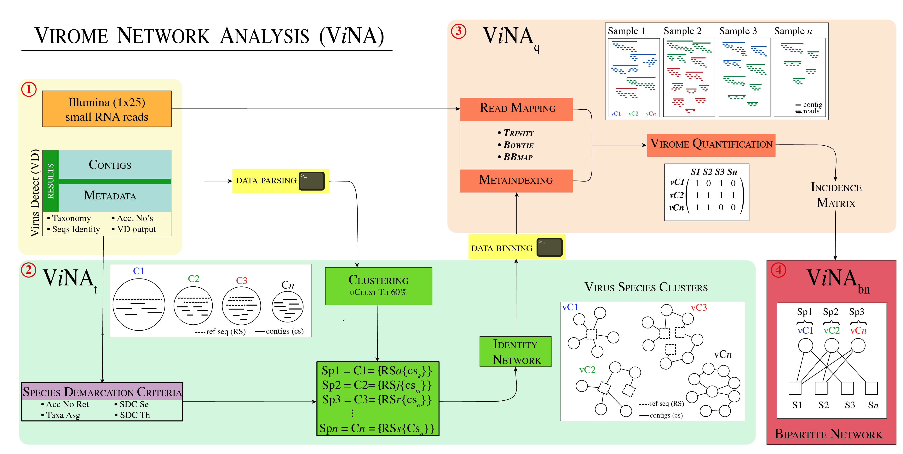

# Sub-Saharan Africa Sweetpotato Virome (SSA-SPV)
## RESULTS

##### Network analysis framework

Fig. 1) Framework diagram\
[]

Seven sweetpoato regions results:\
1- [k-cluster 1](https://github.com/ricardoi/sweetpotato_virome/tree/main/results/k-cluster1): Tanzania and Uganda\
2- [k-cluster 2](https://github.com/ricardoi/sweetpotato_virome/tree/main/results/k-cluster2): Guinea\
3- [k-cluster 3](https://github.com/ricardoi/sweetpotato_virome/tree/main/results/k-cluster3): Benin, Ghana and Nigeria\
4- [k-cluster 4](https://github.com/ricardoi/sweetpotato_virome/tree/main/results/k-cluster4): Malawi, Mozambique, Tanzania and Zimbabwe\
5- [k-cluster 5](https://github.com/ricardoi/sweetpotato_virome/tree/main/results/k-cluster5): Mozambique and Zimbabwe\
6- [k-cluster 6](https://github.com/ricardoi/sweetpotato_virome/tree/main/results/k-cluster6): Ethiopia\
7- [k-cluster 7](https://github.com/ricardoi/sweetpotato_virome/tree/main/results/k-cluster7): Angola\
